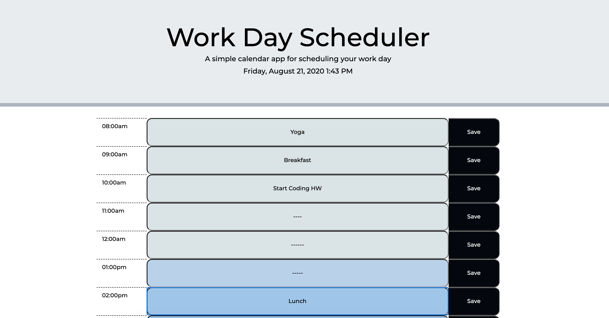

# Day-Planner
Homework 05 - Day Planner

Here is a link to my assingment: 
https://emgal-aguirre.github.io/Day-Planner/

Using moment.js, the time will update live, also changing the colors of the time blocks below past on past, present and future time slots. 

When the user inputs and saves and item, their information will be saved to the local storage. 

